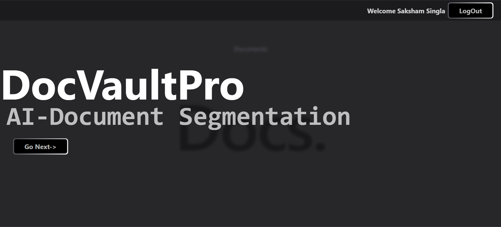
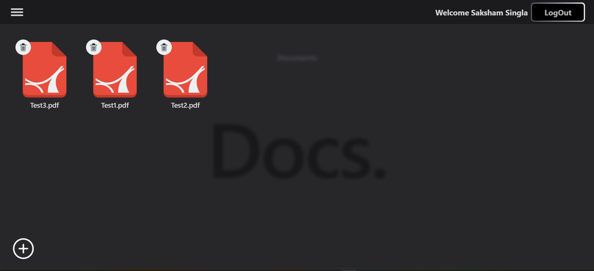
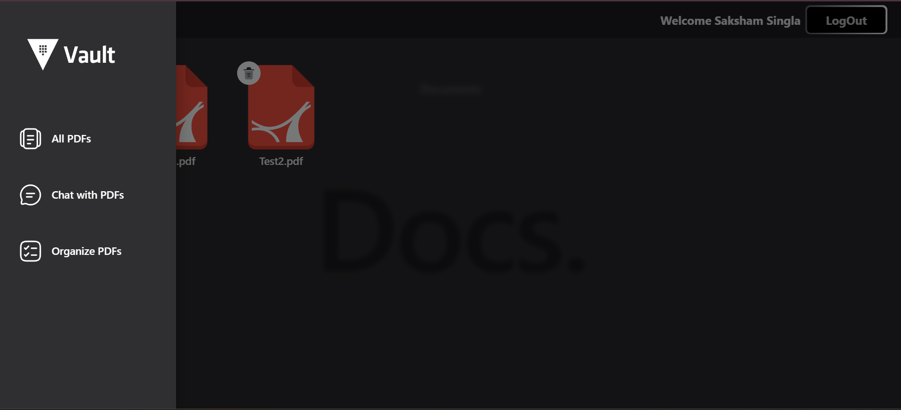
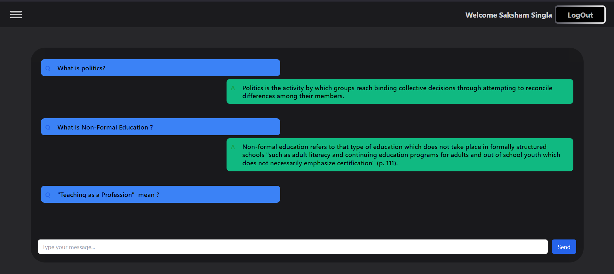
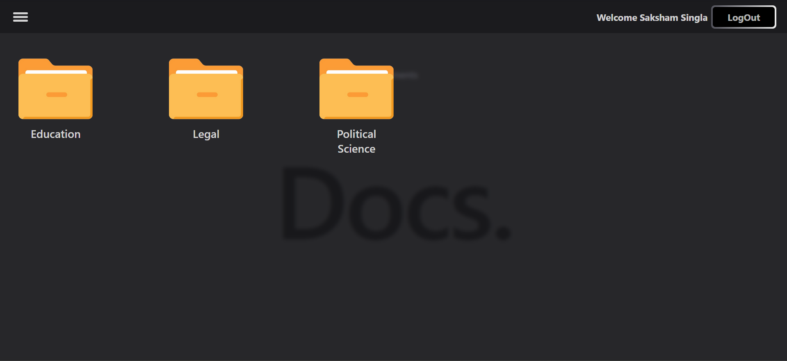

# DocVaultPro

**DocVaultPro** is an AI-powered document management platform that allows users to upload, organize, and interact with PDF files. The platform offers features such as document categorization, AI-based Q&A, and file management. This README provides an overview of the project structure and key features.

## Table of Contents
- [Features](#features)
- [Screenshots](#screenshots)
- [Technologies Used](#technologies-used)

## Features

1. **AI-Powered Q&A**: Users can ask questions related to the content of their documents, and the platform provides AI-generated answers.
2. **Document Categorization**: Users can organize their documents into folders based on different categories such as Education, Legal, Political Science, etc.
3. **File Management**: Users can upload, view, and delete PDF files from their personal vault.
4. **User Authentication**: Secure login/logout functionality is provided for users to manage their documents privately.

## Screenshots

### 1. Landing Page

The welcome screen introduces users to **DocVaultPro** with a simple interface and a "Go Next" button to proceed.

### 2. File Management Dashboard

The dashboard allows users to manage their uploaded documents with options to delete files or add new ones.

Test1:https://www.cambridgescholars.com/resources/pdfs/978-1-5275-0932-0-sample.pdf

Test2:https://cambridgelawstudio.co.uk/wp-content/uploads/2023/04/Unit-1-5-ALE.pdf

Test3:https://egyankosh.ac.in/bitstream/123456789/57833/1/Unit2.pdf

### 3. SideBar UI

### 3. AI-Powered Q&A Interface

The Q&A interface allows users to ask questions about their documents and receive AI-generated responses. For example:
- **Q:** What is politics?
  - **A:** Politics is the activity by which groups reach binding collective decisions through attempting to reconcile differences among their members.
  
- **Q:** What is Non-Formal Education?
  - **A:** Non-formal education refers to that type of education which does not take place in formally structured schools "such as adult literacy and continuing education programs for adults and out-of-school youth which does not necessarily emphasize certification."

### 4. Document Categorization

Users can categorize their documents into different folders such as Education, Legal, and Political Science for better organization.

## Technologies Used
- **Frontend**: React.js, Tailwind CSS
- **Backend**: Python Flask, Langchain
- **AI Integration**: OpenAI API for document-based Q&A
- **Authentication**: Google OAuth for secure user login/logout
